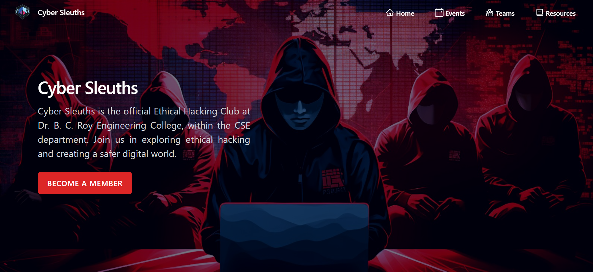

# Cyber Sleuths - Cybersecurity Club Website

 

Welcome to the **Cyber Sleuths** GitHub repository! This is the official website for the ethical hacking club of **Dr. B. C. Roy Engineering College**, located within the CSE department. We're dedicated to fostering a community of cybersecurity enthusiasts who are passionate about ethical hacking, digital forensics, and securing the digital world.

## 🌐 Live Demo

Check out the live website: [Cyber Sleuths Website](https://www.cybersleuths.co.in)

## 🛠️ Features

- **Dynamic Events Page:** Stay updated with the latest events, workshops, and hacking challenges.
- **Interactive Team Section:** Meet the minds behind Cyber Sleuths with a sleek, red-and-black gradient background.
- **Educational Resources:** Access a curated list of tutorials, articles, and tools to enhance your hacking skills.
- **Blog Section:** Read about the latest trends, case studies, and insights in the world of cybersecurity.
- **Responsive Design:** Optimized for both desktop and mobile devices.

## 🚀 Technologies Used

- **Frontend:** React.js, JavaScript, HTML, CSS
- **Styling:** Tailwind CSS, Custom Gradients
- **Animations:** Framer Motion for smooth, modern animations
- **Backend:** Node.Js & MongoDb(for authentication and database )
- **Hosting:** Netlify

## 📝 How to Contribute

We welcome contributions from all skill levels! Here's how you can get involved:

1. **Fork the repository**: Click the "Fork" button at the top right of this page.
2. **Clone your fork**: `git clone https://github.com/cybersleuths/CyberSleuths2.0.git`
3. **Create a new branch**: `git checkout -b feature-name`
4. **Make your changes** and commit them: `git commit -m 'Add new feature'`
5. **Push to the branch**: `git push origin feature-name`
6. **Submit a Pull Request**: We will review your changes and merge them!

## 🤝 Code of Conduct

We follow a strict Code of Conduct to ensure that our community remains welcoming and inclusive.

## 📧 Contact Us

For any inquiries, suggestions, or feedback, feel free to reach out:

- **Email:** info.cybersleuths@bcrec.ac.in
- **GitHub Issues:** Use the issues tab for any bugs or feature requests

---

**Join us on this journey to secure the digital world, one hack at a time!**
